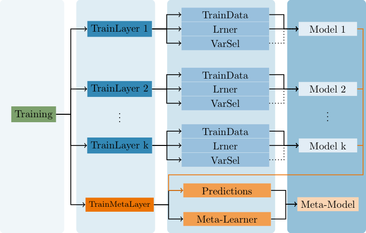
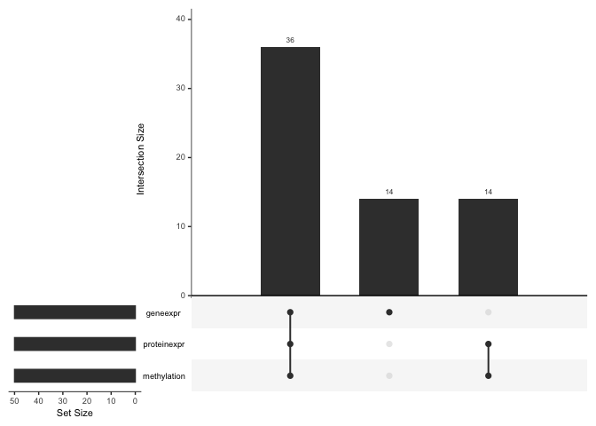
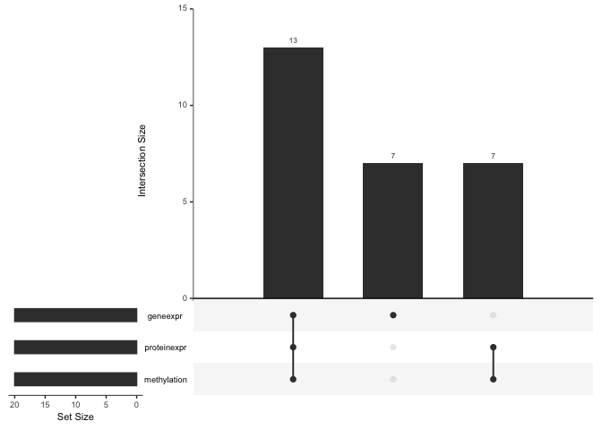

<!-- badges: start -->

[](https://github.com/imbs-hl/fuseMLR/actions/workflows/R-CMD-check.yaml)
[](https://codecov.io/github/imbs-hl/fuseMLR)
[](https://lifecycle.r-lib.org/articles/stages.html#Maturing)
[](http://cranlogs.r-pkg.org/badges/grand-total/fuseMLR)
[](https://stackoverflow.com/questions/tagged/fuseMLR)
<!-- badges: end -->

### fuseMLR

Cesaire J. K. Fouodo

### Introduction

Recent technological advances have enabled the simultaneous targeting of
multiple pathways to enhance therapies for complex diseases. This often
results in the collection of numerous data entities across various
layers of patient groups, posing a challenge for integrating all data
into a single analysis. Ideally, data of the different layers are
measured in the same individuals, allowing for early or intermediate
integrative techniques. However, these techniques are challenging when
patient data only partially overlap. Additionally, the internal
structure of each data entity may necessitate specific statistical
methods rather than applying the same method across all layers. Late
integration modeling addresses this by analyzing each data entity
separately to obtain layer-specific results, which are then integrated
using aggregation methods. Currently, no R package offers this
flexibility.

We introduce the fuseMLR package for late integration prediction
modeling in R. This package allows users to define studies with multiple
layers, data entities, and layer-specific machine learning methods. The
package fuseMLR is user-friendly, enables training of different models
across layers and automatically performs aggregation once layer-specific
training is completed. Additionally, fuseMLR allows for variable
selection at the layer level and makes predictions for new data
entities.

`fuseMLR` is an object-oriented package based on `R6` version 2.5.1.
Refer to our [cheat
sheet](https://github.com/imbs-hl/fuseMLR/blob/master/README_files/figure-gfm/fusemlrcheatsheet.pdf)
for a quick overview of classes and functionalities.

### Installation

Install the development version from GitHub with

``` r
devtools::install_github("imbs-hl/fuseMLR")
```

### Package overview

The following figure illustrates the general architecture of `fuseMLR`:



The general architecture of `fuseMLR` includes the storage classes
`Training`, `Layer`, and `MetaLayer`. `Layer` and `MetaLayer` are stored
within a `Training` instance, while `Data`, `Learner`, and `Varselect`
(for variable selection) are stored within a `Layer` instance. These
components can be used to automatically build and store the `Model` or
`MetaModel`.

### Usage example

The following example is based on simulated data available in `fuseMLR`.
Data have been simulated using the R package `InterSIM`, version 2.2.0.

``` r
library(fuseMLR)
library(UpSetR)
library(ranger)
library(DescTools)
```

#### A) Simulated data.

Two types of data were simulated: training and testing datasets. Each
consists of four `data.frame`s—gene expression, protein expression,
methylation data, and target variable observations. Individuals are
organized in rows, variables in columns, with an additional column for
individual IDs. In total, $70$ individuals with $50$ individuals pro
layer have been simulated for training, and $23$ ($20$ per layer) for
testing. Individuals do not necessarily overlapped. Effects have been
introduced for gene expression and methylation by shifting the means by
$0.5$ to create case-control study with $50$% prevalence. Individuals do
not necessarily overlap. Effects were introduced in gene expression and
methylation by shifting the means by 0.5 to create a case-control study.
For illustration, the number of variables was kept smaller than what is
typically expected in reality. The data simulation code is available
[here](https://github.com/imbs-hl/fuseMLR/blob/master/test_code/build_data.R).

``` r
data("entities")
# This is a list containing two lists of data: training and test.
# Each sublist contains three entities.
str(object = entities, max.level = 2L)
```

    ## List of 2
    ##  $ training:List of 4
    ##   ..$ geneexpr   :'data.frame':  50 obs. of  132 variables:
    ##   ..$ proteinexpr:'data.frame':  50 obs. of  161 variables:
    ##   ..$ methylation:'data.frame':  50 obs. of  368 variables:
    ##   ..$ target     :'data.frame':  70 obs. of  2 variables:
    ##  $ testing :List of 4
    ##   ..$ geneexpr   :'data.frame':  20 obs. of  132 variables:
    ##   ..$ proteinexpr:'data.frame':  20 obs. of  161 variables:
    ##   ..$ methylation:'data.frame':  20 obs. of  368 variables:
    ##   ..$ target     :'data.frame':  30 obs. of  2 variables:

Variable selection, training and prediction are the main functionalities
of `fuseMLR`. We can perform variable selection, train and fuse models
for training studies, and predict new studies.

#### B) Instantiate training resources

We need to set up training resources.

``` r
training <- Training$new(id = "training",
                              ind_col = "IDS",
                              target = "disease",
                              target_df = entities$training$target)
# See also training$summary()
print(training)
```

    ## Training        : training
    ## Status          : Not trained
    ## Number of layers: 1
    ## Layers trained  : 0
    ## n               : 70

- Prepare new training layers: Training layers are components of a study
  and represent the second component of a `fuseMLR` object.

``` r
tl_ge <- TrainLayer$new(id = "geneexpr", training = training)
tl_pr <- TrainLayer$new(id = "proteinexpr", training = training)
tl_me <- TrainLayer$new(id = "methylation", training = training)
# We also prepare the meta layer for the meta analysis.
tl_meta <- TrainMetaLayer$new(id = "meta_layer", training = training)
```

- Add training data (entities) to layers: Exclude the meta layer, as it
  is modified internally after the training phase.

``` r
train_data_ge <- TrainData$new(id = "geneexpr",
                               train_layer = tl_ge,
                               data_frame = entities$training$geneexpr)
train_data_pr <- TrainData$new(id = "proteinexpr",
                               train_layer = tl_pr,
                               data_frame = entities$training$proteinexpr)
train_data_me <- TrainData$new(id = "methylation",
                               train_layer = tl_me,
                               data_frame = entities$training$methylation)
# An overview of the gene expression training data
print(train_data_ge)
```

    ## TrainData : geneexpr
    ## Layer     : geneexpr
    ## ind. id.  : IDS
    ## target    : disease
    ## n         : 50
    ## Missing   : 0
    ## p         : 133

``` r
# An overview of the gene expression training layer
print(tl_ge)
```

    ## TrainLayer            : geneexpr
    ## Status                : Not trained
    ## Nb. of objects stored : 1
    ## -----------------------
    ##        key     class
    ## 1 geneexpr TrainData

``` r
# An overview of the training resources
print(training)
```

    ## Training        : training
    ## Status          : Not trained
    ## Number of layers: 5
    ## Layers trained  : 0
    ## n               : 70

- An upset plot of the training data: Visualize patient overlap across
  layers.

``` r
training$upset(order.by = "freq")
```

<!-- -->

#### C) Variable selection

We need to set up variable selection methods to our training resources.
Note that this can be the same method or different layer-specific
methods. For simplicity, we will set up the same method on all layers.

- Preparation parameters of the variable selection method.

``` r
same_param_varsel <- ParamVarSel$new(id = "ParamVarSel",
                                     param_list = list(num.trees = 1000L,
                                                       mtry = 3L,
                                                       probability = TRUE))
print(same_param_varsel)
```

    ## Class: ParamVarSel
    ## id   : ParamVarSel
    ## Parameter combination
    ## $num.trees
    ## [1] 1000
    ## 
    ## $mtry
    ## [1] 3
    ## 
    ## $probability
    ## [1] TRUE

- Instantiate the variable selection method and assign training layers.

``` r
varsel_ge <- VarSel$new(id = "varsel_geneexpr",
                        package = "Boruta",
                        varsel_fct = "Boruta",
                        param = same_param_varsel,
                        train_layer = tl_ge)

varsel_pr <- VarSel$new(id = "varsel_proteinexpr",
                        package = "Boruta",
                        varsel_fct = "Boruta",
                        param = same_param_varsel,
                        train_layer = tl_pr)
varsel_me <- VarSel$new(id = "varsel_methylation",
                        package = "Boruta",
                        varsel_fct = "Boruta",
                        param = same_param_varsel,
                        train_layer = tl_me)
```

- Perform variable selection on our training resources

``` r
set.seed(5467)
var_sel_res <- training$varSelection()
print(var_sel_res)
```

    ##          Layer   variable
    ## 1     geneexpr     ACVRL1
    ## 2     geneexpr     AKT1S1
    ## 3     geneexpr        BAX
    ## 4     geneexpr     BCL2L1
    ## 5     geneexpr     CDKN1A
    ## 6     geneexpr     CTNNB1
    ## 7     geneexpr       EEF2
    ## 8     geneexpr      EEF2K
    ## 9     geneexpr   EIF4EBP1
    ## 10    geneexpr     MAPK14
    ## 11    geneexpr      NFKB1
    ## 12    geneexpr      PREX1
    ## 13    geneexpr      PRKCD
    ## 14    geneexpr        PXN
    ## 15    geneexpr       SHC1
    ## 16    geneexpr        SRC
    ## 17    geneexpr      XRCC5
    ## 18    geneexpr       YAP1
    ## 19 proteinexpr Caveolin.1
    ## 20 proteinexpr     Rab.25
    ## 21 methylation cg09637363
    ## 22 methylation cg25060573
    ## 23 methylation cg23989635
    ## 24 methylation cg22679003
    ## 25 methylation cg01663570
    ## 26 methylation cg09186685
    ## 27 methylation cg20253551
    ## 28 methylation cg03386722
    ## 29 methylation cg00241355
    ## 30 methylation cg26187237
    ## 31 methylation cg24991452
    ## 32 methylation cg20042228
    ## 33 methylation cg23641145
    ## 34 methylation cg01228636
    ## 35 methylation cg17489897
    ## 36 methylation cg21573601
    ## 37 methylation cg00059930
    ## 38 methylation cg19427472
    ## 39 methylation cg16925486
    ## 40 methylation cg00239419
    ## 41 methylation cg23323671
    ## 42 methylation cg07160163
    ## 43 methylation cg12507125

For each layer, the variable selection results show the chosen
variables. In this example, we perform variable selection. Users can opt
to conduct variable selection on individual layers if desired.

#### D) Training

We can now train our models using the subset of selected variables.
Users can choose to set up layer-specific learners, but for
illustration, we will use the same learner for all layers.

- Set up the same leaner parameters.

``` r
same_param <- ParamLrner$new(id = "ParamRanger",
                             param_list = list(probability = TRUE,
                                               mtry = 1L),
                             hyperparam_list = list(num.trees = 1000L))
```

- Set up learners for each layer. We will use a weighted sum,
  implemented internally by `fuseMLR`, for the meta-analysis.

``` r
lrner_ge <- Lrner$new(id = "ranger",
                      package = "ranger",
                      lrn_fct = "ranger",
                      param = same_param,
                      train_layer = tl_ge)
lrner_pr <- Lrner$new(id = "ranger",
                      package = "ranger",
                      lrn_fct = "ranger",
                      param = same_param,
                      train_layer = tl_pr)
lrner_me <- Lrner$new(id = "ranger",
                      package = "ranger",
                      lrn_fct = "ranger",
                      param = same_param,
                      train_layer = tl_me)
lrner_meta <- Lrner$new(id = "weighted",
                        lrn_fct = "weightedMeanLearner",
                        param = ParamLrner$new(id = "ParamWeighted",
                                               param_list = list(),
                                               hyperparam_list = list()),
                        na_rm = FALSE,
                        train_layer = tl_meta)
```

- Train the models with the selected variables.

``` r
set.seed(5462)
# Retrieve the target variable for resampling reasons. Resampling will be used by
# fuseMLR to generate meta data.
disease <- training$getTargetValues()$disease
trained <- training$train(resampling_method = "caret::createFolds",
                                   resampling_arg = list(y = disease,
                                                         k = 2L),
                                   use_var_sel = TRUE)
# Let us now check the status of our training resources.
print(trained)
```

    ## Training        : training
    ## Status          : Trained
    ## Number of layers: 5
    ## Layers trained  : 4
    ## n               : 70

``` r
# Let us check the status of a layer as well.
print(tl_ge)
```

    ## TrainLayer            : geneexpr
    ## Status                : Trained
    ## Nb. of objects stored : 4
    ## -----------------------
    ##               key     class
    ## 1        geneexpr TrainData
    ## 2 varsel_geneexpr    VarSel
    ## 3          ranger     Lrner
    ## 4        rangerMo     Model

``` r
## On the meta model
# TODO: Remove me after testing.
tmp_model <- tl_meta$getModel()
print(tmp_model$getBaseModel())
```

    ##    geneexpr proteinexpr methylation 
    ##   0.3134868   0.4019984   0.2845149 
    ## attr(,"class")
    ## [1] "weightedMeanLearner"

- Retrieve the basic model of a specific layer.

``` r
model_ge <- tl_ge$getModel()
print(model_ge)
```

    ## Class           : Model
    ## 
    ## Learner info.   
    ## -----------------------
    ## Learner          : ranger
    ## TrainLayer       : geneexpr
    ## Package          : ranger
    ## Learn function   : ranger
    ## 
    ## Train data info.      
    ## -----------------------
    ## TrainData : geneexpr
    ## Layer     : geneexpr
    ## ind. id.  : IDS
    ## target    : disease
    ## n         : 50
    ## Missing   : 0
    ## p         : 19

#### E) Predicting

Now, we have created training resources, performed variable selection
and trained the models with the chosen variables. In this section, we
create testing resources and make predictions for new data.

- Create the testing object.

``` r
testing <- Testing$new(id = "testing", ind_col = "IDS")
```

- Create new layers.

``` r
nl_ge <- TestLayer$new(id = "geneexpr", testing = testing)
nl_pr <- TestLayer$new(id = "proteinexpr", testing = testing)
nl_me <- TestLayer$new(id = "methylation", testing = testing)
```

- Instantiate and add new training data to new layers.

``` r
new_data_ge <- TestData$new(id = "geneexpr",
                           new_layer = nl_ge,
                           data_frame = entities$testing$geneexpr)
new_data_pr <- TestData$new(id = "proteinexpr",
                           new_layer = nl_pr,
                           data_frame = entities$testing$proteinexpr)
new_data_me <- TestData$new(id = "methylation",
                           new_layer = nl_me,
                           data_frame = entities$testing$methylation)
```

- An upset plot of the training data: Visualize patient overlap across
  layers.

``` r
testing$upset(order.by = "freq")
```

<!-- -->

- Predict the testing object.

``` r
predictions <- training$predict(testing = testing)
print(predictions)
```

    ## $predicting
    ## Predicting   : testing
    ## Nb. layers   : 4
    ## 
    ## $predicted_values
    ##          IDS  geneexpr proteinexpr methylation meta_layer
    ## 1  patient23 0.4066226  0.59039563  0.15416111 0.40867002
    ## 2  patient77 0.4723008  0.48607738  0.13143770 0.38085834
    ## 3  patient62 0.7903321  0.96848254          NA 0.89042670
    ## 4  patient43 0.3204345          NA          NA 0.32043452
    ## 5   patient8 0.7283837  0.85136032  0.83154603 0.80717132
    ## 6  patient74 0.5480369  0.71174921  0.53741508 0.61082692
    ## 7  patient29 0.3765401  0.44897460  0.29004206 0.38104867
    ## 8  patient17 0.4029615  0.31254802          NA 0.35216230
    ## 9  patient25 0.2794885  0.46890833  0.08669206 0.30078151
    ## 10 patient54 0.8010825          NA  0.84085476 0.82000521
    ## 11 patient60 0.7464111  0.84661310  0.79673889 0.80101115
    ## 12 patient44 0.3812123          NA          NA 0.38121230
    ## 13  patient1 0.8132333  0.93826706          NA 0.88348407
    ## 14 patient76 0.6725758          NA  0.64178889 0.65792812
    ## 15 patient16 0.6695210          NA  0.65919841 0.66460978
    ## 16 patient27 0.3560107          NA  0.19385952 0.27886306
    ## 17 patient58 0.5584369  0.75391905  0.78681071 0.70199615
    ## 18 patient52 0.4704524  0.13166706          NA 0.28010441
    ## 19 patient10 0.2658341          NA          NA 0.26583413
    ## 20 patient72 0.6804016  0.94305873  0.62568056 0.77042038
    ## 21 patient39        NA  0.09239167          NA 0.09239167
    ## 25 patient46        NA  0.22666706  0.49346349 0.33723674
    ## 26 patient97        NA  0.71532579  0.86267421 0.77639208
    ## 27 patient31        NA  0.27787698          NA 0.27787698
    ## 31 patient87        NA  0.29450754  0.26970952 0.28423038
    ## 33 patient59        NA  0.14348016  0.37254722 0.23841348
    ## 34  patient2        NA  0.54899484  0.81064603 0.65743216
    ## 53 patient85        NA          NA  0.15869206 0.15869206
    ## 60  patient3        NA          NA  0.56772579 0.56772579

- Prediction performances for layer-specific available patients, and all
  patients on the meta layer.

``` r
pred_values <- predictions$predicted_values
actual_pred <- merge(x = pred_values,
                     y = entities$testing$target,
                     by = "IDS",
                     all.y = TRUE)
x <- as.integer(actual_pred$disease == 2L)

# On all patients
perf_estimated <- sapply(X = actual_pred[ , 2L:5L], FUN = function (my_pred) {
  bs <- BrierScore(x = x[complete.cases(my_pred)],
                   pred = my_pred[complete.cases(my_pred)], na.rm = TRUE)
  return(bs)
})
print(perf_estimated)
```

    ##    geneexpr proteinexpr methylation  meta_layer 
    ##  0.12058651  0.16047024  0.08220819  0.12624550

- Prediction performances for overlapping individuals.

``` r
# On overlapping patients
perf_overlapping <- sapply(X = actual_pred[complete.cases(actual_pred),
                                           2L:5L],
                         FUN = function (my_pred) {
  bs <- BrierScore(x = x[complete.cases(actual_pred)], pred = my_pred)
  return(bs)
})
print(perf_overlapping)
```

    ##    geneexpr proteinexpr methylation  meta_layer 
    ##  0.13864230  0.13319993  0.06688031  0.10194224

- Prediction performances for non-overlapping individuals.

``` r
# On non-overlapping patients
perf_not_overlapping <- sapply(X = actual_pred[!complete.cases(actual_pred),
                                               2L:5L],
                         FUN = function (my_pred) {
  bs <- BrierScore(x = x[!complete.cases(actual_pred)],
                   pred = my_pred, na.rm = TRUE)
  return(bs)
})
print(perf_not_overlapping)
```

    ##    geneexpr proteinexpr methylation  meta_layer 
    ##          NA          NA          NA          NA

© 2024 Institute of Medical Biometry and Statistics (IMBS). All rights
reserved.
